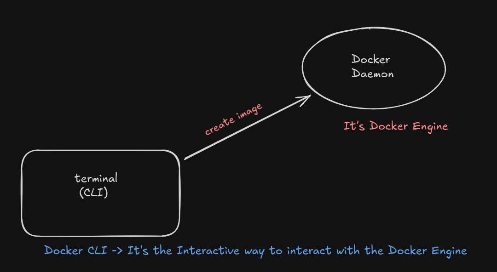
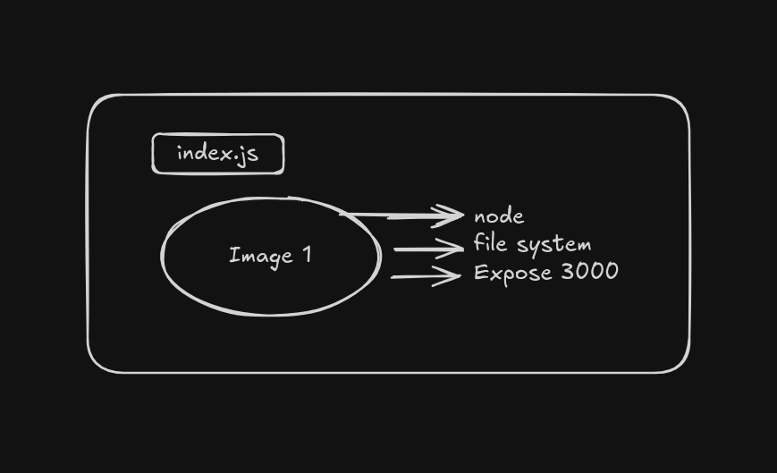
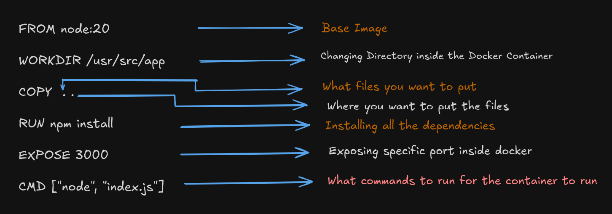
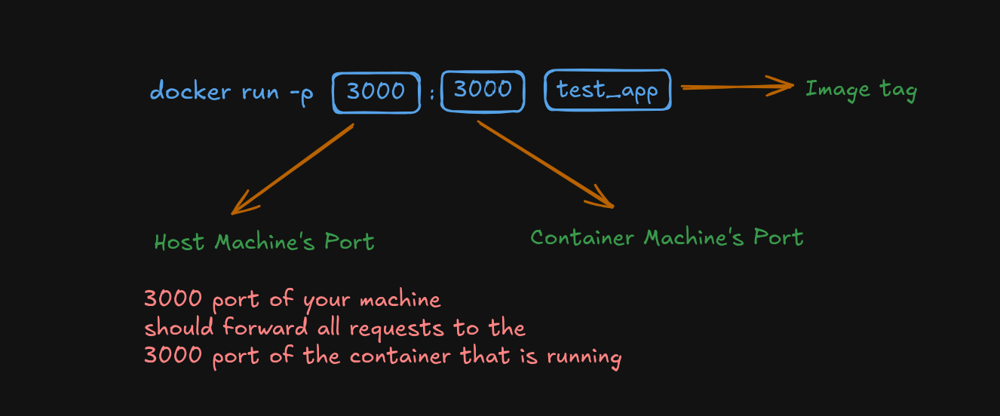

# `Docker Fundamentals`
## Why we need `docker`?
01. Makes it easy to `setup` project locally.
02. `Dockerize` your own app.
03. Learning to `deploy` via `Docker`
    - `Dockerfile`
    - `docker-compose.yml` 

## Why `Containarization` ?
01. Everyone has different `operating` system.
02. Steps to run a project can vary based on `OS`.
03. Extremely harder to keep track of `dependencies` as project grows.
04. What is there was a way to describe your projects configuration in a **single** file `?`
05. What if that could be run in an `isolated` environment `?`
06. Makes local setup of `OS` projects a breeze.
07. Makes installing `auxiliary` services `[Ex: DB, Redis]` easy.

## The Problem `Docker` Solves
- Everyone has different `operating` system. Example: `Linux`, `Window`, `Mac`.
- The way to install `node.js` or `python` or `Django` on `Mac` machine it's completely different in `Windows` machine.
- There are other dependencies such as `Database`, `Kafka` these needs to setup separately which is different for every `operating` system.
- Every developer on a team may use a different OS, requiring individual environment configuration.
- What if we could write all these in a `single file`?
    - **The Solution** is `Dockerfile` 
- Irrespects of whether you're on `Mac`, `Windows` or `Linux` machine you all have to just run a single commad and which will be same for everyone `(Mac, Windows or Linux)`
- **Docker is one way of containarization**
- `Containarization` involves building self sufficiant software packages that perform consistently, regardless of the `machines` they run on.
- **It's basically taking the snapshot of a machine, the filesystem and letting you use and deploy it as a construct**

## Why `Docker` ?
- Makes your life easy when you're setting up project locally.
- Makes it easier to deploy `containers`. 
- Allows for `container orchestration` which makes `deployment` a breeze. `[Kubernetes]`

## Inside `Docker`
- `Docker` has 3 parts
    - `CLI`
    - `Engine`
    - `Registry` (Dockerhub)
        - It is the place where you can store your project's `image`


- Instead of `code` `DockerHub` contains `images` that are going to be deployed.
- Once a developer created an image, they can deploy it to `dockerhub`.
- `AWS`, `GCP` can pull your image from the `Dockerhub` and run it immediately.
- **DockerHub isn't the only registry**
    - `AWS`, `GCP` both of them has their own registry.
    - **DockerHub is the most popular registry**

## `Image` Vs `Containers`

- `Image` is an Independent entity which has not just your source code, but also the `dependencies` your source code needs to run.
- We can use this `image` on `Windows`, `Linux` or `Mac` machine without any problem.
- **When we run this image then it's called `Container`**
- **An Image in execution is called `Container`**
- We can then push this image into `DockerHub` 


- [Github Link](https://github.com/hkirat/docker-roadmap)

- Here a simple http server of `node.js` has been `dockerized`.
- `Exercise` 
    - Check for `python` and `golang` based services

## `Dockerfile`
- This is where you tell your full stack application what `dependencies` you need for the project to run ?
- What external libraries do you need ?
- What parts do you need to expose ?
- What final command you need to run to convert your `image` inito a running `container` ?
- Where can you find your project specific files ?

## Sample `Node.js` DockerFile
```
FROM node:20
WORKDIR /usr/src/app
COPY . .
RUN npm install
EXPOST 3000
CMD ["node", "index.js"]
```


- First 4 steps run at **build time** (creating the image)
- Last command runs at **runtime** (when the container starts)
- **The last `two` steps doesn't run when you're creating an `Image`. It runs when you're running the `Image`**

## Important Questions
- **Should you copy over `node_modules` from your file system over to the `Docker` image?**
    - Yes. You should copy over `package.json` and inside the images where you run `npm install`
    - Search the proper explanation and add `here`

- **What's the difference between `CMD` and `RUN` ?**
    -  `RUN` means install bunch of things inside the container
    - `CMD` means before the `image` gets converted into a container, you actually start the container and run this

- **How can you create an `image` from the `Dockerfile` ?**
    - ```docker build . -t <image_tag>```
    - provide `image_tag` name as your need

- **How to create `Image` from `dockerfile` and run this `image` ?**
    - ```docker run test_app```
    - But since we haven't expose `port` so won't access it



- **How you can push your `Image` to `DockerHub` ?**
    - see the references on `google` :(

- **Can anyone from the Internet use my Image by pulling it from the `Dockerhub` ?**
    - Yes. But here need `port mapping`
    - After pulling the image and adding proper port mappingg they can run and access the `api's` from that particular `image`

## Command Recap
```
docker build . -t <tag_name>
```
```
dockr run <tag_name>
```
```
docker login
```
```
docker push <tag_name>
```
```
docker pull <tag_name>
```

