# `Docker Fundamentals`
## Why we need `docker`?
01. Makes it easy to `setup` project locally.
02. `Dockerize` your own app.
03. Learning to `deploy` via `Docker`
    - `Dockerfile`
    - `docker-compose.yml` 

## Why `Containarization` ?
01. Everyone has different `operating` system.
02. Steps to run a project can vary based on `OS`.
03. Extremely harder to keep track of `dependencies` as project grows.
04. What is there was a way to describe your projects configuration in a **single** file `?`
05. What if that could be run in an `isolated` environment `?`
06. Makes local setup of `OS` projects a breeze.
07. Makes installing `auxiliary` services `[Ex: DB, Redis]` easy.

## The Problem `Docker` Solves
- Everyone has different `operating` system. Example: `Linux`, `Window`, `Mac`.
- The way to install `node.js` or `python` or `Django` on `Mac` machine it's completely different in `Windows` machine.
- There are other dependencies such as `Database`, `Kafka` these needs to setup separately which is different for every `operating` system.
- Every developer on a team may use a different OS, requiring individual environment configuration.
- What if we could write all these in a `single file`?
    - **The Solution** is `Dockerfile` 
- Irrespects of whether you're on `Mac`, `Windows` or `Linux` machine you all have to just run a single commad and which will be same for everyone `(Mac, Windows or Linux)`
- **Docker is one way of containarization**
- `Containarization` involves building self sufficiant software packages that perform consistently, regardless of the `machines` they run on.
- **It's basically taking the snapshot of a machine, the filesystem and letting you use and deploy it as a construct**

## Why `Docker` ?
- Makes your life easy when you're setting up project locally.
- Makes it easier to deploy `containers`. 
- Allows for `container orchestration` which makes `deployment` a breeze. `[Kubernetes]`

## Inside `Docker`
- `Docker` has 3 parts
    - `CLI`
    - `Engine`
    - `Registry` (Dockerhub)
        - It is the place where you can store your project's `image`


- Instead of `code` `DockerHub` contains `images` that are going to be deployed.
- Once a developer created an image, they can deploy it to `dockerhub`.
- `AWS`, `GCP` can pull your image from the `Dockerhub` and run it immediately.
- **DockerHub isn't the only registry**
    - `AWS`, `GCP` both of them has their own registry.
    - **DockerHub is the most popular registry**

## `Image` Vs `Containers`

- `Image` is an Independent entity which has not just your source code, but also the `dependencies` your source code needs to run.
- We can use this `image` on `Windows`, `Linux` or `Mac` machine without any problem.
- **When we run this image then it's called `Container`**
- **An Image in execution is called `Container`**
- We can then push this image into `DockerHub` 


- [Github Link](https://github.com/hkirat/docker-roadmap)

- Here a simple http server of `node.js` has been `dockerized`.
- `Exercise` 
    - Check for `python` and `golang` based services

## `Dockerfile`
- This is where you tell your full stack application what `dependencies` you need for the project to run ?
- What external libraries do you need ?
- What parts do you need to expose ?
- What final command you need to run to convert your `image` inito a running `container` ?
- Where can you find your project specific files ?

## Sample `Node.js` DockerFile
```
FROM node:20
WORKDIR /usr/src/app
COPY . .
RUN npm install
EXPOST 3000
CMD ["node", "index.js"]
```


- First 4 steps run at **build time** (creating the image)
- Last command runs at **runtime** (when the container starts)
- **The last `two` steps doesn't run when you're creating an `Image`. It runs when you're running the `Image`**

## Important Questions
- **Should you copy over `node_modules` from your file system over to the `Docker` image?**
    - Yes. You should copy over `package.json` and inside the images where you run `npm install`
    - Search the proper explanation and add `here`

- **What's the difference between `CMD` and `RUN` ?**
    -  `RUN` means install bunch of things inside the container
    - `CMD` means before the `image` gets converted into a container, you actually start the container and run this

- **How can you create an `image` from the `Dockerfile` ?**
    - ```docker build . -t <image_tag>```
    - provide `image_tag` name as your need

- **How to create `Image` from `dockerfile` and run this `image` ?**
    - ```docker run test_app```
    - But since we haven't expose `port` so won't access it


- **How you can push your `Image` to `DockerHub` ?**
    - see the references on `google` :(

- **Can anyone from the Internet use my Image by pulling it from the `Dockerhub` ?**
    - Yes. But here need `port mapping`
    - After pulling the image and adding proper port mappingg they can run and access the `api's` from that particular `image`

## Command Recap
```
docker build . -t <tag_name>
```
```
dockr run <tag_name>
```
```
docker login
```
```
docker push <tag_name>
```
```
docker pull <tag_name>
```


# `Docker` Part-02
## Topics Covered
- Caching images, layers in docker
- `Volumes` and `Networks`, adding `DB`
- Multi stage builds
- Understanding `docker compose`
- Creating `docker compose` 

## `Caching` and `Layers`
- Sample `Dockerfile`
```
FROM node:20
WORKDIR /usr/src/app
COPY . .
RUN npm install
EXPOSE 8000
CMD ["node", "index.js"]
```
- When you run `docker build .` docker starts to create these layers one by one

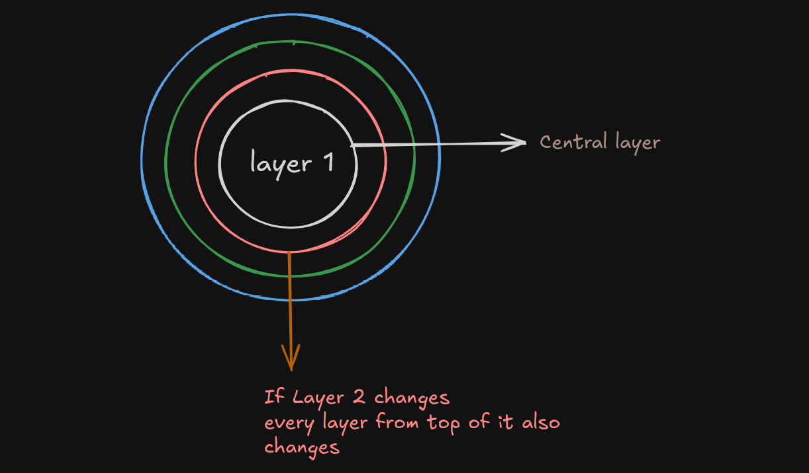

## Why `layers` ?
- Caching
- Re-using layers
- Faster build times

## Task 01: Figure out a way to make `Docker` build faster

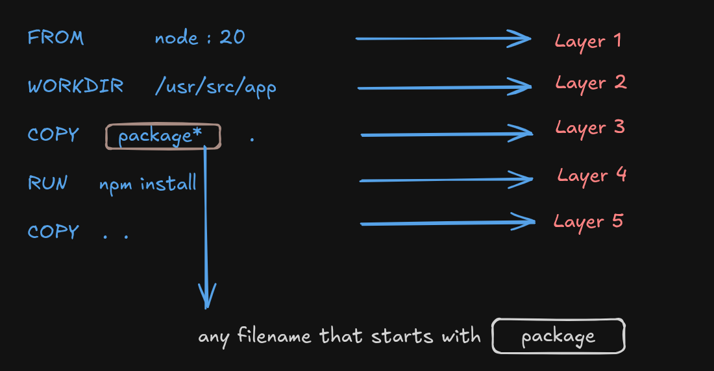

- But `why` `package.json` is copying over before other files ?
    - Based on the `packages` listed on `package.json` **RUN npm install** installs all the necessary dependencies
    - In Any `JS` based projects `package.json` doesn't changes often
    - For `Python` it is similar to `requirements.txt`
    - Since only the last layer changes for this reason `COPY . .`

## Advantages of `Docker`
- Instead of manually installing `DBs/Redis/Auxiliary Services` we can use them via `Docker`
- It's very much useful so we don't pollute our filesystem with unnecessary dependencies
- We can easily bring up and down `DBs/Redis/Auxiliary Services/Kafka` and clean out our machine

## But there has also `downside` of this approach
- **We want local databases to retain information across restarts (`Volume`)**
    - Databases need to persist data
- **We want to allow one docker container to talk to another docker container (`Networks`)**
    - But isn't this becoming counter intuitive cause every docker container must remain separate?

- A backend container might need to talk to `mongodb` container
    - How does it do that?
        - Here comes `Network`

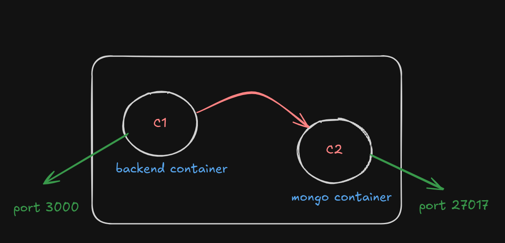

## `Volumes`
- Used for `persisting` data across starts
- Specifically useful for things like `databases`

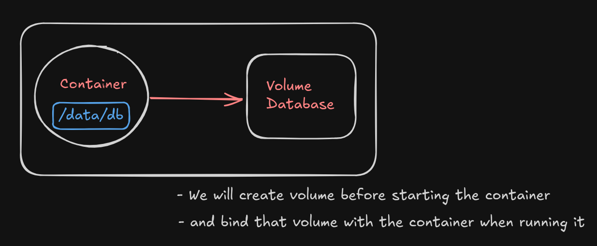

## What is `Volume` ?
- It is a `logical` place where you can `dump` data
- If you ever bring down a container the volume space actually stays. Until you bring down the volume

## Commands for creating and using volume
- Command for creating volume
    - this persists until you delete the volume
```
docker volume create volume_database
```
```
docker run -v volume_database:/data/db -p 27017:27017 mongo
```
```
docker exec -it container_id /bin/bash
```
- **Command for killing container**
```
docker kill <container_id>
```
- **Command for removing volume**
```
docker volume rm volume_database
```
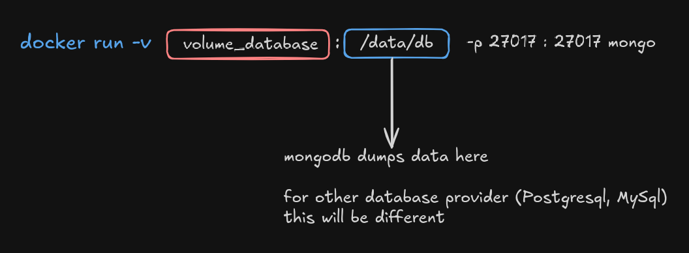

## What is `Network` ?
- When we're running `codebase` locally, then backend can easily interact with the `Database`
- Let's say, `MongoDB` connection is
```
mongodb://localhost:27017/mydatabase
```
- Here, `DB` connection port is defined by my device

- **But when `Backend code` and `Database` both of them are running separately on container the `problem` occurs**
- Cause, each container has its own network since each `container` is isolated, separately working as individual `mini` machine
- So, that mini machine has it's own `localhost` but that localhost connection isn't the `isolated` database container's connection
- One container can't talk to the host machine on to other container
- **How can the Backend talk to the MongoDB then ?**
    - Answer is `MongoDB`

## `Docker Network`
- For one container to talk to another container we need  to give them some logical binding Which is known as `Network`

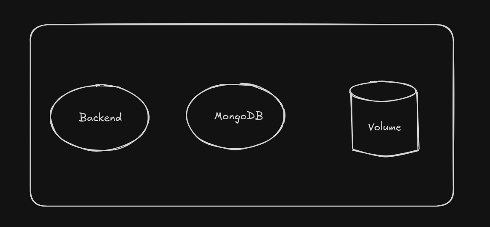

- Each container have their own network
- What is `network` ?
    - `localhost`
    - `127.0.0.1`
    - `https:google.com`

- One container can't talk to the host machine on to other machine
- They need a way to talk to the `DB` instance let's say `mongodb`

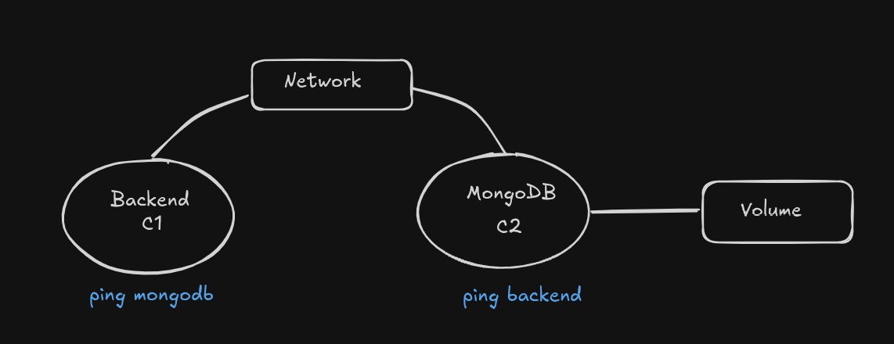

## Command for `Networks`
```
docker network create my_custom_network
```
```
docker run -p 3000:3000 --name backend --network my_custom_network <image_tag>
```
```
docker run -v volume_database:/data/db --name mongo --network my_custom_network -p 27017:27017 mongo
```
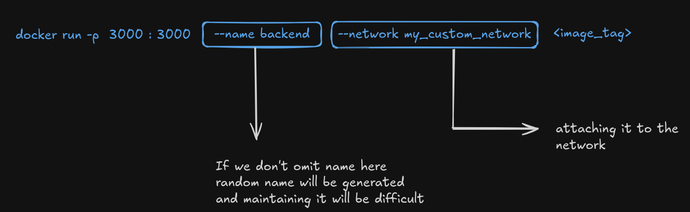

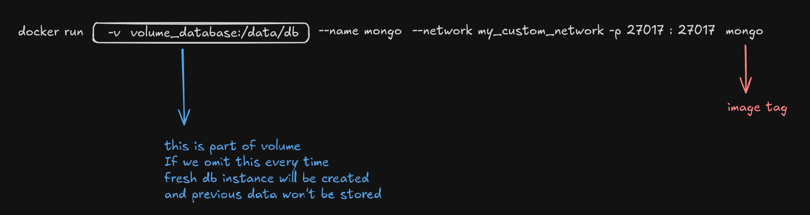

## `Env` Variables - Why?
- The problems
    - It is difficult to keep `editing` files
    - You should not check in database urls
        - `DB Secrets` should not be `hardcoded` and `open` to use
    - `Env` variables are language independent construct to send secrets to process

## `Multi Stage` Builds
- What if we want to allow `dev` backend to allow `hot reload` but the `prod` env to not?

## Example `Dockerfile`
```
FROM node:20 AS base
WORKDIR /usr/src/app
COPY package*.json ./
RUN npm install

FROM base AS development
COPY . .
CMD ["npm", "run", "dev"]

FROM base AS production
COPY . .
RUN npm prune --production
CMD ["npm", "run", "start"]
```

- **Note: based on the `base image` vim or other dependencies listed in the container or not depends**

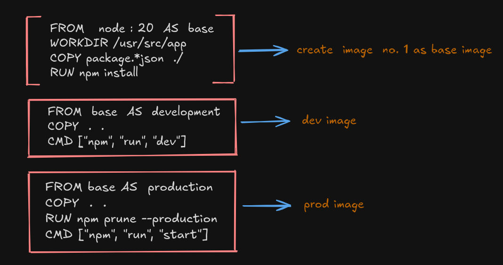

- **By slightly modifying `docker build or run` commands we can run or build `dev` or `prod` image**

## Commands for building and running `multi stage` image
```
docker build . --target development -t myapp:dev
```

```
docker run myapp:dev
```
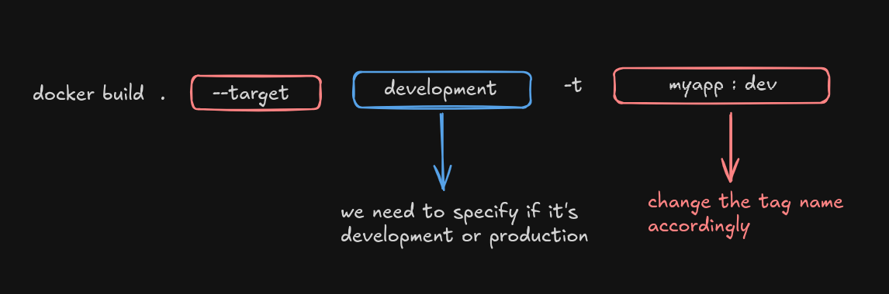